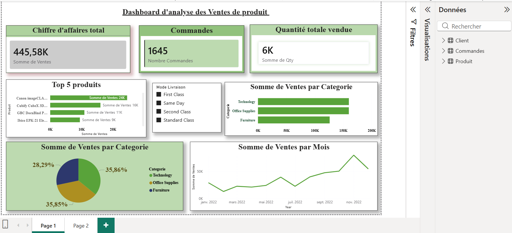
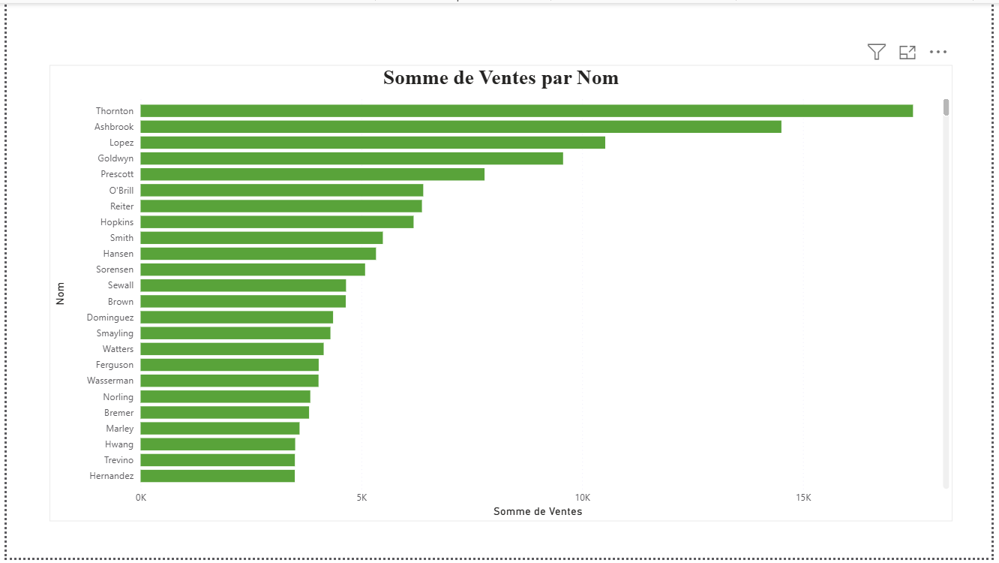

# Product Sales Analysis Dashboard (Power BI)

## Project Overview

This project presents an interactive **Power BI dashboard** designed to analyze product sales performance. The dashboard provides key insights into revenue, product demand, category performance, and sales trends over time.

The goal of this project is to help decision-makers monitor business performance through clear and interactive visualizations.

By analyzing transactional sales data, this dashboard highlights important business indicators such as total revenue, number of orders, quantity sold, best-performing products, and category contribution to overall sales.

---

## Objectives

The main objectives of this project are:

- Monitor overall **sales performance**
- Identify the **best-selling products**
- Analyze **sales distribution by category**
- Track **sales evolution over time**
- Provide **interactive filtering** for deeper insights
- Support **data-driven decision making**

---

## Tools and Technologies

The following tools and technologies were used in this project:

- **Power BI** – Data visualization and dashboard creation
- **CSV / Excel dataset** – Source of transactional data
- **Data modeling** – Structuring relationships between tables
- **Business Intelligence techniques** – KPI tracking and visual analysis

---

## Dataset Description

The dataset used in this project contains transactional sales information including:

- Customer information
- Product details
- Order quantities
- Sales revenue
- Product category
- Delivery mode
- Transaction date

These data points allow us to perform comprehensive sales analysis and identify patterns in product demand.

---

## Key Performance Indicators (KPIs)

The dashboard highlights several important business metrics:

- **Total Revenue** – Overall sales value generated
- **Number of Orders** – Total orders processed
- **Total Quantity Sold** – Total number of products sold

These KPIs give a quick overview of the company’s commercial performance.

---

## Dashboard Features

The Power BI dashboard includes the following analytical components:

### 1. Top 5 Best-Selling Products
Displays the products generating the highest revenue.

### 2. Sales by Category
Analyzes the total sales generated by each product category.

### 3. Category Distribution
Shows the contribution of each category to overall revenue.

### 4. Monthly Sales Trend
Tracks the evolution of sales over time to identify seasonal patterns.

### 5. Delivery Mode Filter
Allows users to filter the dashboard based on shipping method.

---

## Dashboard Preview

Below is a preview of the dashboard:

---

## Business Insights

Using this dashboard, decision-makers can easily:

- Identify the **most profitable products**
- Understand which **categories drive revenue**
- Monitor **sales growth over time**
- Detect **changes in customer demand**
- Evaluate the impact of **delivery methods on sales**

These insights support strategic decisions such as product prioritization, inventory planning, and marketing strategies.

---

## How to Use the Dashboard

1. Download the `.pbix` file from this repository.
2. Open it using **Microsoft Power BI Desktop**.
3. Explore the dashboard and interact with the filters and visuals.

---

## Author

**Ange Désiré Boua**  
Master’s Student in **Big Data & Artificial Intelligence**  
Institut Universitaire d'Abidjan

---

## Portfolio

This project is part of my **Data Science and Business Intelligence portfolio**, showcasing skills in:

- Data analysis
- Business Intelligence
- Dashboard design
- Data visualization
- Decision-support analytics
